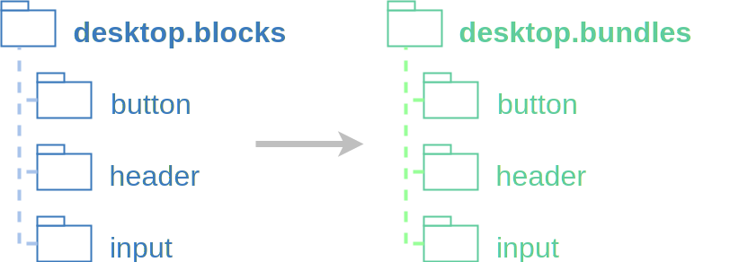

---

layout: yandex2

style: |
    /* собственные стили можно писать здесь!! */

    .headphones {
        width: 845px;
        margin: 0 auto;
    }
    
    .cfg-before {
        position: absolute;
        top: -30px;
        right: 950px;
        border: 1px solid #3C7ABC;
    }

    .cfg-after {
        position: absolute;
        top: -30px;
        left: 950px;
        border: 1px solid #3C7ABC;
    }
    
    .w100 { width: 100% }
    .w85 { width: 85% }
    .w50 { width: 50% }


---

# {:.logo}

## {{ site.presentation.title }}
{:.title}

### {{ site.presentation.service }}



{:.nda}


<div class="authors">

<p>{{ site.author.name }}, {{ site.author.position }}</p>



<p>{{ site.author2.name }}, {{ site.author2.position }}</p>


</div>

## **ПѢница, [01.04.2016](https://study.yandex-team.ru/lib/talks/1784)**

## Заголовок будет скрыт
{:.fullscreen .black}

{:.headphones}

## Заголовок будет скрыт
{:.fullscreen .black}


## **npm&nbsp;&nbsp;i&nbsp;&nbsp;[direct-dev](https://www.npmjs.com/package/direct-dev)<br /><br />npm&nbsp;&nbsp;i&nbsp;&nbsp;[direct-dev-server](https://www.npmjs.com/package/direct-dev-server)**

## Что они делают?
{:.section}

## **Собирают артефакты, полезные для разработчика**

## Этапы сборки

1. Собрать информацию о проекте 
2. {:.next} Сконфигурировать сборку
3. {:.next} Собрать бандлы
4. {:.next} Открыть в браузере или сформировать отчет

## Walker
{:.section}

## **Динамически конфигурирует сборку**

## Динамически<br/>конфигурирует сборку

{:.w85}

## Рефакторинг 

- вынести логику из конфига ENB
- {:.next} разбить код на модули
- {:.next} предоставить информацию о проекте
{:.big}

## Как работает

{:.w85}

## Пример плагина
{:.fullscreen}

```js
// пример плагина
class TestBundler {
    constructor(config = {}) {
        this.config = config;
    }
    eachBlock(blockData, blockName) {
        return {
            block: blockName,
            entities: Object.keys(blockData.entities),
            hasTests: !!blockData.techs['test.js']
        };
    }
    allBlocks(data) {
        fs.writeFile(this.config.path, JSON.stringify(data));
    }
}
```

## **Подходит для обработки собранных бандлов**

## Подходит для обработки собранных бандлов

{:.w85}

## Технологии ENB
{:.section}

## Технологии ENB

- фильтрация файлов

## Фильтрация файлов: по блоку

{:.w50}

## Фильтрация файлов: по уровню

{:.w50}

## Технологии ENB

- фильтрация файлов
- выполнение модульных тестов

## Выполнение модульных тестов

{:.w100}

## Заглушки результатов тестов

{:.w100}

## Технологии ENB

- фильтрация файлов
- выполнение модульных тестов
- выборочная обработка файлов

## Выборочная обработка файлов

&lt;схема&gt;

## Разработческий сервер 
{:.section}

## Разработческий сервер

- пересборка при изменении файлов
- {:.next} обработка параллельных запросов на сборку 
- {:.next} умное кэширование

## Инструменты

- Walker &mdash; настраивает сборку на&nbsp;основе информации о&nbsp;проекте
- Технологии ENB &mdash; сборка артефактов
- Разработческий сервер &mdash; удобная отладка

## **npm&nbsp;&nbsp;i&nbsp;&nbsp;[direct-dev](https://www.npmjs.com/package/direct-dev)<br /><br />npm&nbsp;&nbsp;i&nbsp;&nbsp;[direct-dev-server](https://www.npmjs.com/package/direct-dev-server)**

## Контакты 
{:.contacts}



<figure markdown="1">

### {{ site.author.name }}


{{ site.author.position }}


</figure>





<figure markdown="1">

### {{ site.author2.name }}


{{ site.author2.position }}


</figure>



<!-- разделитель контактов -->
-------

<!-- left -->
- {:.mail}dima117a@yandex-team.ru
- {:.skype}dima117a
- {:.github}dima117

<!-- right -->
